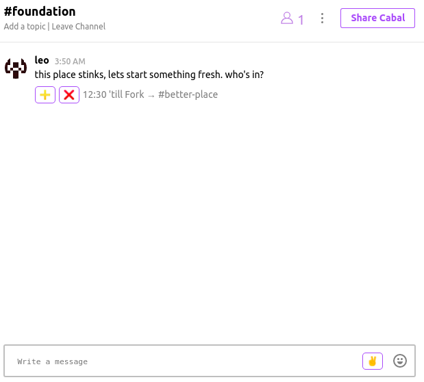

# Forked Chats

First cited [here](https://twitter.com/tru1mprssn/status/1247734911278002177) by [@tru1mprssn](https://twitter.com/tru1mprssn)

- As a user, I want to initiate a forked chat, by selecting an emoji button like ✌.
- Upon selection, I want to input a channel name in a field, with # of hours till (or % of people within the chat vote).
- Upon enter, I want the interface to create a clickable emoji of + / - in a certain type of supported message
- This element will have a countdown timer (or % complete ratio) to auto-initiate the new channel.

## Approach
Upon voting, each user would sign a public message using their public key to accept fork or decline fork. Accepting fork will automatically create a temporary entry in the log for the name of the channel to join. On time expiry, that user will be added.

## Notes
- should forking enforce leaving previous channel? 
- or, just make some type of embeddable message button to join (instead of searching)

## Implementation
Code for a work in progress can be found [here](https://github.com/prm3theus/cabal-desktop) using [cabal chat](http://cabal.chat)

Ex.

  

